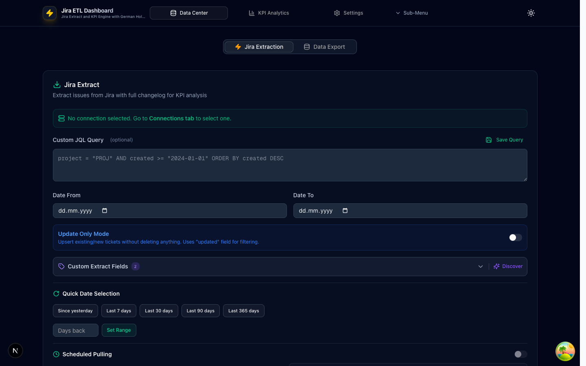
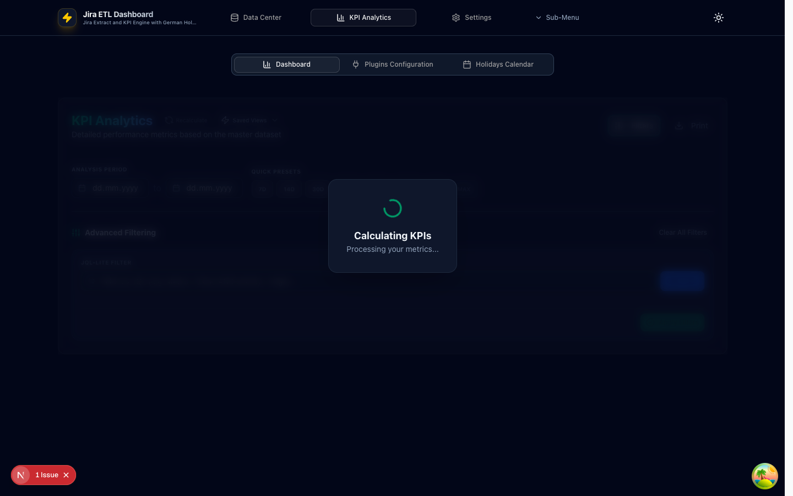
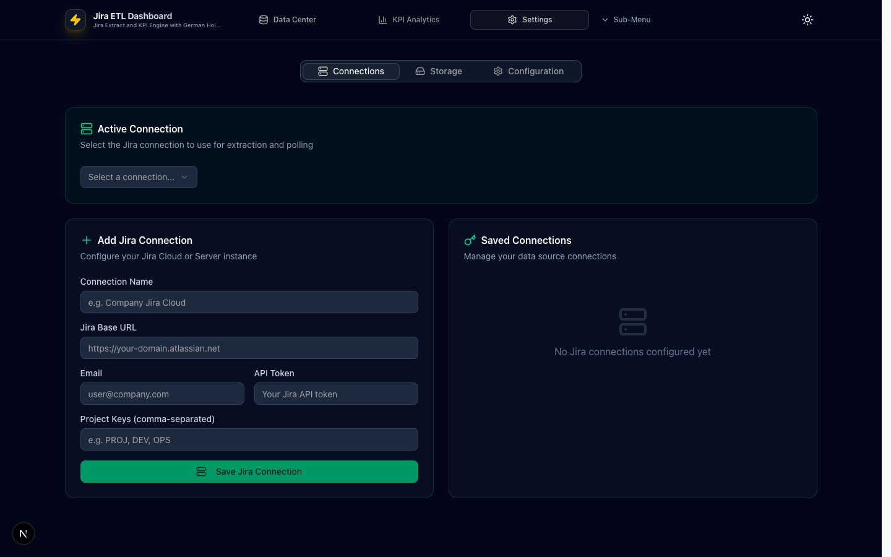
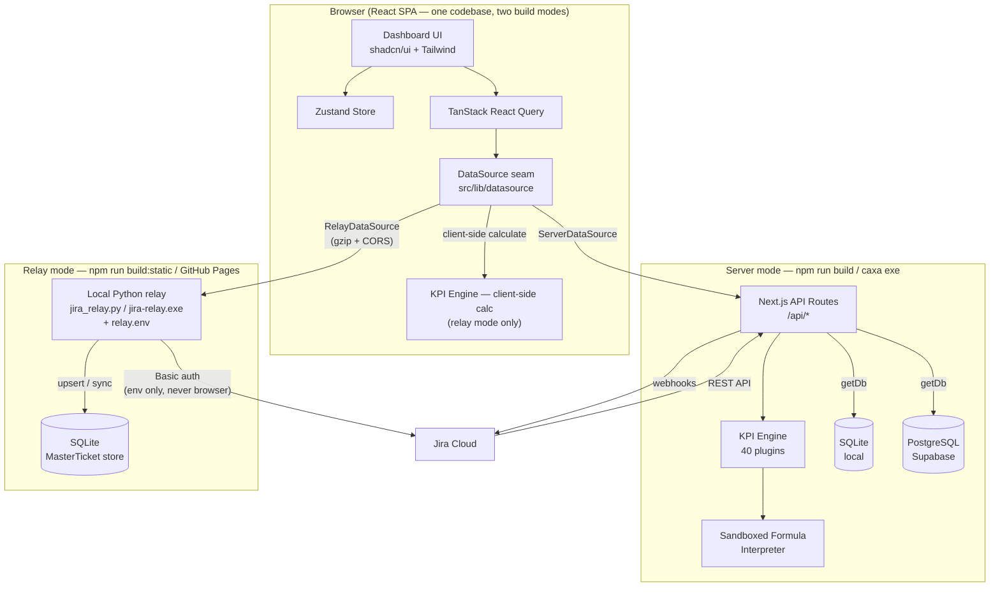
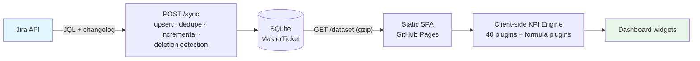
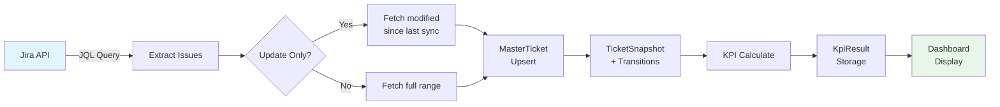
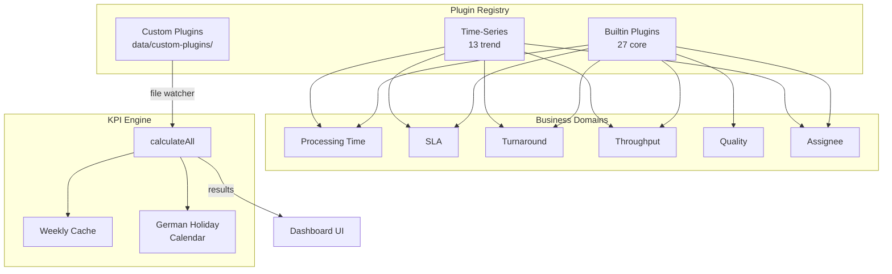

# Jira ETL Dashboard for Metabase

A professional ETL dashboard that extracts ticket data from Jira Cloud or Server, calculates custom KPIs with **German holiday-aware business hour calculations**, and exports results to **Metabase** via CSV/JSON or PostgreSQL synchronization.

Built with **Next.js 16**, **React 19**, **Prisma ORM**, **shadcn/ui**, and **Tailwind CSS 4**.

## 📸 Screenshots

### Data Center
Extract ticket data from Jira with JQL queries, date range selection, scheduled polling, and export to CSV/JSON/PostgreSQL. The extraction list previews results with key, summary, assignee, and status columns — filter by multiple statuses at once, search, and sort (newest created by default).

<p align="center">
  
</p>

### KPI Analytics
Interactive dashboard with 40 KPI plugins, drill-down capabilities, chart visualizations, saved views, and alert thresholds.

<p align="center">
  
</p>

### Settings
Manage Jira connections, storage engine configuration (SQLite/PostgreSQL), and application settings.

<p align="center">
  
</p>

---

## 🚀 Advanced Features

### 🔍 Interactive KPI Drill-down & Performance
- **Actionable Metrics** — Click any KPI card or chart bar to instantly view the specific Jira issues comprising that metric.
- **Side-out Issue Drawer** — High-speed preview of ticket summaries, assignees, and status with direct links back to Jira.
- **Virtual Scrolling** — Powered by `react-virtuoso` to handle large lists (1000+ tickets) in drill-downs with zero lag.

### 📊 Professional Visualization Engine
- **New Analytics Plugins** — Added **Cumulative Flow Diagrams (CFD)**, **Cycle Time Distribution (Histogram)**, **Aging WIP Analysis**, and **First Response Time** metrics.
- **Synchronized Comparison** — Distribution charts include "This Week" and "Previous Week" comparison layers with non-zero data filtering.
- **Individual Chart Export** — Download any specific visualization as a high-quality PNG image for presentations.
- **Modern Aesthetics** — Premium dark-mode interface with glassmorphism effects and smooth transitions.

### 🌓 Professional Dashboard UX
- **Saved Views / Presets** — Save named dashboard states (Dates, JQL, Filters, Layouts) to switch between different reporting contexts instantly.
- **Interactive Metrics Table** — Toggle between a grid of cards and a high-density, sortable/filterable data table for rapid metric scanning.
- **KPI Alert Thresholds** — Set custom Warning and Critical limits for any plugin; includes animated pulse alerts and hover tooltips.
- **Keyboard Shortcuts**:
  - `R` — Recalculate Dashboard
  - `/` — Focus JQL Search
  - `1`, `2`, `3` — Quick Tab Navigation
  - `Cmd/Ctrl + P` — Export to Print/PDF

### ⚡ Architecture & Data Confidence
- **Dual Build Modes** — One codebase ships as the server product (`npm run build` → caxa exe) **and** as a static GitHub Pages app backed by a local Python relay (`npm run build:static`); a build-time mode flag plus the `DataSource` seam (`src/lib/datasource/`) selects the backend, so server-mode behavior is unchanged.
- **Hybrid Storage Architecture** — Dynamically switches between local SQLite and remote PostgreSQL (Supabase) at runtime based on frontend storage configuration (server mode).
- **Dual Prisma Clients** — Utilizes a specialized multi-client wrapper to support cross-engine compatibility without re-generating schemas or restarting the server.
- **TanStack React Query** — Advanced state management for automated background data synchronization, intelligent caching, and consistent loading states.
- **Scheduled Polling Resilience** — Server-side background sync persists storage configurations across sessions, ensuring data lands in the correct engine automatically (server mode).
- **Resilient Error Boundaries** — Individual widget isolation ensures that a single metric failure or calculation error never crashes the entire dashboard.
- **Hardened Local API Surface** — Unauthenticated endpoints accept loopback-origin requests only (CSRF protection), Jira issue keys are validated before use, and ETL runs are marked complete only after a fully successful load.
- **Security Headers** — HSTS, Content-Security-Policy, Permissions-Policy, X-Frame-Options, X-Content-Type-Options, and Referrer-Policy are set on all responses; the static build ships a relay-scoped CSP meta tag.
- **Smart Calculation Placement** — KPI computation runs on the server via the calculation API in server mode, and in the browser over the relay dataset in static mode — the same 40-plugin engine either way, with TanStack Query handling caching, background refetching, and consistent loading states to keep the UI responsive even with tens of thousands of tickets.

---

## 🛠️ Core Capabilities

### Jira ETL & Data Extraction
- **Dynamic Storage Engines** — Store your master dataset locally in SQLite for privacy or on Supabase for team-wide accessibility via Metabase.
- **Master Dataset Management** — Automatically tracks additions, updates, and deletions to maintain a faithful local mirror of Jira data.
- **Scheduled Polling** — Robust server-side background sync (1min–4hr intervals) that survives restarts and hot-reloads; the extraction list silently refreshes when a scheduled run completes.
- **Extraction Logic** — Smart `update-only` mode that fetches only modified tickets since the last sync to minimize API load.
- **Live Extraction List** — Preview extracted issues with key, summary, assignee, and status columns; combine free-text search with multi-select status filtering and sort by key or created/updated date (newest created by default).

### KPI Calculation Engine
**40 built-in plugins** (27 core + 13 time-series) organized by business domain. Every time-based KPI **excludes weekends and German holidays** (all 16 states supported), with configurable work hours.

#### Core Plugins (27)

**Processing Time (7)**

| Plugin | Unit | What it measures | Example |
|--------|:----:|------------------|---------|
| **Avg. Processing Hours** (`avg_processing_hours`) | hours | Average business hours from creation to resolution | 3 tickets taking 10h, 20h, 30h → shows **20h** |
| **Median Processing Hours** (`median_processing_hours`) | hours | Median business hours — resists outliers | `[10h, 20h, 90h]` → shows **20h** (not the 40h average) |
| **Avg. Working Days** (`avg_working_days`) | days | Average working days to resolution, skipping weekends/holidays | Created Mon, resolved next Wed → ≈ **3 working days** |
| **Cycle Time Histogram** (`cycle_time_histogram`) | tickets | Distribution of resolution times across buckets | Buckets `0–8h`, `8–24h`, `1–3d`… with counts per bucket |
| **Aging WIP Analysis** (`aging_wip`) | tickets | Open tickets bucketed by how long they've been open | Highlights stale work, e.g. `> 160h` bucket |
| **Avg. First Response Time** (`first_response_time`) | hours | Time from creation to first assignee comment/transition | First response after **4 business hours** |
| **Resolution Time by Priority** (`resolution_time_by_priority`) | hours | Avg business hours to resolution per priority | High **12h** vs Low **48h** — is urgent really faster? |

**SLA (4)**

| Plugin | Unit | What it measures | Example |
|--------|:----:|------------------|---------|
| **SLA Compliance Rate** (`sla_compliance`) | % | % of tickets resolved within the configured SLA target | 40h target; 8 of 10 in time → **80%** |
| **SLA Compliance by Priority** (`sla_by_priority`) | % | Compliance rate per priority level | High **90%**, Medium **75%**, Low **60%** |
| **SLA Compliance by Status** (`sla_by_status`) | % | % of status durations meeting per-status targets (comments reset the clock) | `In Review` met its 8h target **70%** of the time |
| **SLA Compliance by Status (Excl. Clones)** (`sla_by_status_excl_clone`) | % | Same, but skips tickets with "CLONE" in the summary | Excludes clone churn for a cleaner signal |

**Turnaround (3)**

| Plugin | Unit | What it measures | Example |
|--------|:----:|------------------|---------|
| **Time In Status** (`time_in_status`) | hours | Avg business hours spent in each workflow status | `In Review` averages **16h** per ticket |
| **No Comment Follow-up** (`no_comment_followup`) | tickets | Open tickets with no new comment for > 3 / > 7 working days | Flags **5** tickets silent for over a week |
| **No Activity Follow-up** (`no_activity_followup`) | tickets | Open tickets with no comment *and* no status change for > 3 / > 7 working days | Stricter variant — status changes also reset the clock |

**Throughput (7)**

| Plugin | Unit | What it measures | Example |
|--------|:----:|------------------|---------|
| **Throughput** (`throughput`) | tickets | Created / Resolved / currently Open for the period | Created **40**, Resolved **35**, Open **12** |
| **Open Tickets by Priority** (`open_tickets_by_priority`) | tickets | Non-resolved tickets per priority, split by age | High **8**, of which **3** are > 2 weeks old |
| **Closed Tickets by Priority** (`closed_tickets_by_priority`) | tickets | Resolved tickets per priority, split by close time | Low **12** closed this period |
| **Open Tickets by Status** (`open_tickets_by_status`) | tickets | Non-resolved tickets per workflow status, split by age | `In Progress` **10**, `Blocked` **2** |
| **Open Tickets in Kanban View** (`open_tickets_kanban`) | tickets | Open tickets organized by Assignee / Status / Age | Kanban-style board with drill-down |
| **Weekly Ticket List** (`weekly_ticket_list`) | tickets | Opened and closed tickets, this week vs last week | This week opened **9** / closed **7** |
| **Backlog Age Percentiles** (`backlog_age_percentiles`) | days | Open-ticket age as P50 / P90 / oldest calendar days | P50 **12d**, P90 **45d**, oldest **200d** |

**Quality (4)**

| Plugin | Unit | What it measures | Example |
|--------|:----:|------------------|---------|
| **Resolution Rate** (`resolution_rate`) | % | % of created tickets that have been resolved | 80 of 100 resolved → **80%** |
| **Avg. Reassignments** (`reassignment_count`) | reassignments | Average number of assignee changes per ticket | Average **1.4** hand-offs per ticket |
| **First-Time Resolution Rate** (`first_time_resolution_rate`) | % | % resolved without any reassignment (first assignment stuck) | **62%** resolved on first assignment |
| **Escalation Rate** (`escalation_rate`) | % | % of tickets whose priority was raised at least once (P3 → P0) | **3.5%** escalated; 105 de-escalated tracked in details |

**Assignee (2)**

| Plugin | Unit | What it measures | Example |
|--------|:----:|------------------|---------|
| **Open Tickets by Assignee** (`open_tickets_by_assignee`) | tickets | Non-resolved tickets per assignee, split by age | Alice **7**, Bob **4** (2 stale) |
| **Open Tickets by Issue Owner Team** (`open_tickets_by_issue_owner_team`) | tickets | Non-resolved tickets per owning team, split by age | Team LTIC-A **15** open |

#### Time-Series / Trend Plugins (13)

Trend plugins return a point per period and render as line/area charts. Several now ship in **daily, weekly, and monthly** variants.

| Plugin | Interval | Unit | What it measures | Example |
|--------|:--------:|:----:|------------------|---------|
| **Processing Time Trend** (`processing_time_trend`) | weekly | hours | Avg business hours to resolve, per week | W02 **18h**, W03 **22h** |
| **Throughput Trend** (`throughput_trend`) | weekly | tickets | Tickets resolved per week | W02 **9**, W03 **12** |
| **Priority Inflow Trend** (`priority_inflow_trend`) | weekly | tickets | New tickets per week, split P0 → P3 | W03: P1 **4**, P2 **7** |
| **Cumulative Flow Diagram** (`cumulative_flow_trend`) | daily | tickets | Tickets in each status over time (stacked CFD) | Growing `In Progress` band signals WIP buildup |
| **SLA Trend** (`sla_trend`) | weekly | % | SLA compliance rate per week | W02 **85%**, W03 **78%** |
| **SLA Compliance by Status Trend** (`sla_by_status_trend`) | weekly | % | Per-status SLA compliance per week, with per-status target reference lines | `In Review` dips below its target line |
| **SLA Compliance by Status Trend (Excl. Clones)** (`sla_by_status_excl_clone_trend`) | weekly | % | Same as above, excluding "CLONE" tickets | Cleaner trend without clone noise |
| **Time In Status Trend (Daily)** (`time_in_status_trend_daily`) | daily | hours | Avg hours per status, grouped by day | Daily `In Review` averages |
| **Time In Status Trend (Weekly)** (`time_in_status_trend_weekly`) | weekly | hours | Avg hours per status, grouped by week | Weekly `In Review` averages |
| **Time In Status Trend (Monthly)** (`time_in_status_trend_monthly`) | monthly | hours | Avg hours per status, grouped by month | Monthly `In Review` averages |
| **Open Tickets by Assignee Trend** (`open_tickets_by_assignee_trend`) | weekly | tickets | Open tickets per assignee over time | Alice's backlog trending down |
| **Open Tickets by Assignee Trend (daily)** (`open_tickets_by_assignee_trend_daily`) | daily | tickets | Same, grouped by day | Day-by-day workload shifts |
| **Open Tickets by Assignee Trend (monthly)** (`open_tickets_by_assignee_trend_monthly`) | monthly | tickets | Same, grouped by month | Month-over-month capacity |

> **Tip:** SLA-by-status trend charts draw a dashed reference line at each status's configured target, so a series dipping below its line is immediately visible.

All time-based KPIs **exclude weekends and German holidays** (all 16 states supported), with configurable work hours.

### 🎯 Plugin Architecture
**File-Based Auto-Discovery System** — Plugins are stored as independent files in domain-based directories and registered automatically at server startup; a file watcher tracks the custom-plugin directory for changes.

```
src/lib/kpi/plugins/
├── builtin/              # Core plugins (27 plugins)
│   ├── processing-time/  # 7 plugins
│   ├── sla/              # 4 plugins
│   ├── turnaround/       # 3 plugins
│   ├── throughput/       # 7 plugins
│   ├── quality/          # 4 plugins
│   └── assignee/         # 2 plugins
├── time-series/          # Trend analysis plugins (13 plugins)
│   ├── processing-time/  # 1 plugin
│   ├── sla/              # 3 plugins
│   ├── turnaround/       # 3 plugins (daily/weekly/monthly)
│   ├── throughput/       # 3 plugins
│   └── assignee/         # 3 plugins (daily/weekly/monthly)
└── custom/               # Scaffolding only — runtime custom plugins load from data/custom-plugins/
```

### 🔌 Custom Plugin Support
**Extend without Code Changes** — Create custom KPI plugins either through the dashboard's Plugin Studio (stored with your local configuration) or by dropping plugin files into the `data/custom-plugins/` directory.

**Features:**
- **Auto-Discovery** — File-based plugins detected and loaded on server startup
- **File Watching** — File system watcher monitors `data/custom-plugins/` for changes
- **Domain Organization** — Group custom plugins by business domain
- **Validation** — Automatic plugin structure validation before registration
- **Error Isolation** — Custom plugin failures don't affect built-in plugins
- **Sandboxed Formulas** — Custom DSL (`COUNT`/`AVG`/`SUM`/`PERCENTAGE`) and JavaScript formulas run in a sandboxed expression interpreter — no `eval`/`new Function`, with an allow-list of safe methods only (see `custom_plugin_guide.md`)
- **UI Management** — Enable/disable plugins, create new plugins via the Plugin Studio

**Getting Started (file-based):**
1. Create a new file: `data/custom-plugins/{domain}/my-metric.ts`
2. Export a `KpiPlugin` object with `id`, `name`, `calculate` function
3. Restart the server — plugin files are loaded at startup
4. Manage via **KPI Analytics** → **Plugins Configuration** → **Custom Plugins**

**SLA Comment Rule Configuration** — Choose how SLA clock resets work for SLA by Status calculations:
- **Assignee Only** (default): Only comments from the ticket's assignee reset the SLA clock
- **Anyone**: Any comment on the ticket resets the SLA clock
Configure this in **KPI Analytics** → **Plugins Configuration** → **SLA Targets by Status**

**Workflow-Specific Formula KPIs** — Site-specific metrics (rework ping-pong, clone share, rejection rate, reporter workload, top resolvers, weekly WoW snapshot, reopened tickets, open-by-project, …) are implemented as sandboxed **JavaScript/DSL formula plugins** and shipped in a local `kpi-plugin-config.json` export rather than the compiled registry, so each installation can tune them without code changes. Import the file via **Settings → Configuration Management → Import**.

> **Due dates are rarely used in this workflow** — most tickets carry none. Due-date metrics (*Overdue Open Tickets*, *Due-Date Adherence*) therefore cover **only the subset of tickets that have a due date set**; interpret their percentages against that subset, not against all tickets.

---

## 🏗️ Technical Architecture

### Tech Stack
| Layer | Technology |
|-------|-----------|
| Framework | Next.js 16 (App Router), React 19, TypeScript 5 |
| State Management | **TanStack React Query 5** (Caching & Background Sync) |
| Performance | **React Virtuoso** (Virtual Scrolling) |
| Computation | Server-side KPI engine (`/api/kpi/calculate`) with query caching |
| UI | shadcn/ui, Tailwind CSS 4, Radix UI, Framer Motion |
| Database | **Prisma 6 (Dual-Client)** — SQLite (local) + PostgreSQL (Supabase) |
| Charts | Recharts 2.15 (Interactive Layers) |
| Exports | html-to-image (PNG), CSV/JSON |

### System Architecture

One React SPA, two build-time backends — the `DataSource` seam picks the implementation:



Static (relay) mode in detail:



### ETL Data Flow (server mode)



### KPI Plugin Architecture



---

## 🛠️ Getting Started

### Prerequisites
- Node.js 20.9+ (Node 22 LTS recommended — used by CI)
- Jira API Token (for Cloud) or Password (for Server)

### Installation
```bash
npm install
npm run dev
```

> `npm install`, `npm run dev`, and `npm run build` automatically run the Prisma setup
> hook (`scripts/prisma-setup.mjs`), which generates the SQLite/PostgreSQL clients and
> pushes the schema to the local SQLite database.

### Environment variables
Copy `.env.example` to `.env` and adjust the values as needed:

| Variable | Purpose |
|----------|---------|
| `DATABASE_URL` | Database connection string (SQLite file path or PostgreSQL URL) |
| `JIRA_WEBHOOK_SECRET` | Shared secret used to authenticate incoming Jira webhooks |
| `CUSTOM_PLUGIN_DIR` | Directory scanned for custom KPI plugins (defaults to `data/custom-plugins/`) |
| `PORT` | Port the server listens on |
| `HOSTNAME` | Hostname/IP the server binds to |
| `PLAYWRIGHT_BASE_URL` | Override e2e test base URL (defaults to `http://localhost:3000`) |

### Database Initialization
If you are using an external PostgreSQL database (like Supabase), initialize the schema once.

**Option 1: Using a .env file (Recommended)**
1. Add `DATABASE_URL="your-postgresql-url"` to your `.env` file.
2. Run: `npm run db:push:pg`

**Option 2: Cross-platform command line**
*   **Windows (PowerShell):** `$env:DATABASE_URL="your-url"; npm run db:push:pg`
*   **Windows (cmd):** `set DATABASE_URL=your-url && npm run db:push:pg`
*   **Linux/macOS:** `DATABASE_URL="your-url" npm run db:push:pg`

### Build & Release
```bash
# Create a portable Windows release folder with database bundled
build-exe.bat
```

### Static GitHub Pages Build (relay mode)

The app ships in two build modes from one codebase:

| | Server mode (`npm run build` / exe) | Static mode (`npm run build:static` → GitHub Pages) |
|---|---|---|
| Backend | Next.js API routes + Prisma (SQLite/PostgreSQL) | Local Python relay (`scripts/jira_relay.py`) + SQLite |
| KPI calculation | Server-side engine | **Client-side** in the browser |
| Credentials | Browser localStorage → API routes | **Only in the relay's environment** — never in the browser |
| File-based custom plugins, polling scheduler, webhook, PG export | ✅ | Hidden (feature-flagged) |
| Formula plugins (Plugin Studio), dashboard views, CSV/JSON export | ✅ | ✅ (localStorage / client-side) |

```bash
npm run build:static   # → ./out  (deploy to GitHub Pages)
python scripts/jira_relay.py   # the local data relay (stdlib only, no pip deps)
```

For users **without Python**, `build-relay-exe.bat` (Windows) /
`build-relay-exe.sh` (macOS/Linux) packages the relay into a standalone
`dist/jira-relay` executable via PyInstaller — ship it next to a `relay.env`
config file (template: `scripts/relay.env.example`) and it runs anywhere.

See **[docs/STATIC_RELAY_MODE.md](docs/STATIC_RELAY_MODE.md)** for relay setup, environment variables, the standalone exe, migrating an existing `custom.db`, and the GitHub Pages workflow.

---

## 🧪 Development & Testing

```bash
npm test               # Vitest unit/integration suite
npm run test:coverage  # Coverage with enforced minimum thresholds (ratchet)
npm run e2e            # Playwright end-to-end suite (reuses a running dev server)
npm run lint           # ESLint (critical rules enabled; ratchet threshold 780)
npm run type-check     # TypeScript strict check
```

Unit tests live in `__tests__/` directories next to the code they cover (shared mocks in `src/test/`); E2E specs live in `e2e/`. CI runs coverage, lint, type-check, and the Playwright E2E suite on every push to `main`/`develop`.

**E2E base URL:** Set `PLAYWRIGHT_BASE_URL` to override the default `http://localhost:3000` when running e2e tests against a different server.

---

## License
Private project. All rights reserved.
